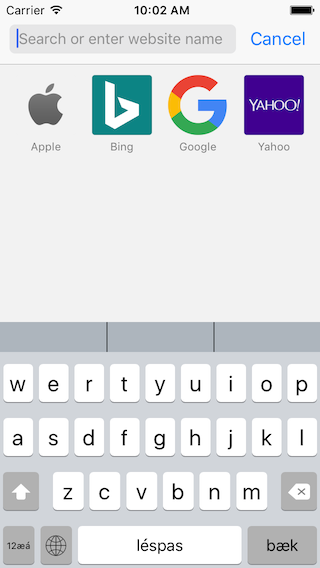
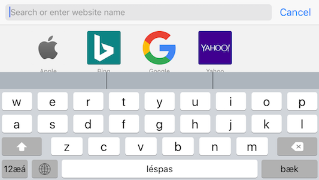
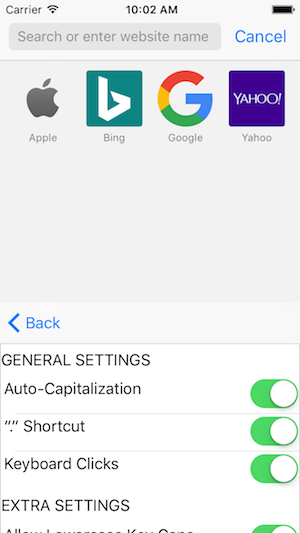

# Kouri-Vini (built on Archagon's Tasty Imitation Keyboard)

I am currently developing a keyboard and hosting app for the Kouri-Vini Community (aka Louisianan Creole, ISO-639 lou). This keyboard is build upon Archagon's Tasty-imitation-keyboard and incorporates the improvements and modifcations made by PolishedCode.

At the current state, the keyboard works well on iPhones. However, the landscape ipad orientation is not currently correct.

## Recent Screenshots

</img>
</img>
</img>

## Purpose
The keyboard was created basically to allow Kouri-Vini speakers have a language specific keyboard. I am posting it on Github for the hope that others might use this code to create keyboard support for other minority languages. If you wish to contact me or learn about the current state of the Kouri-Vini Keyboard Project, check out www.keyboardsupport.wordpress.com

## License

This project is licensed by Archagon under the 3-clause ("New") BSD license. Credit also goes to PolishedCode and other Github members who have contributed. I also want to credit Apple for making a great keyboard to be reverse-engineered; so they too get a large bit of credit.
