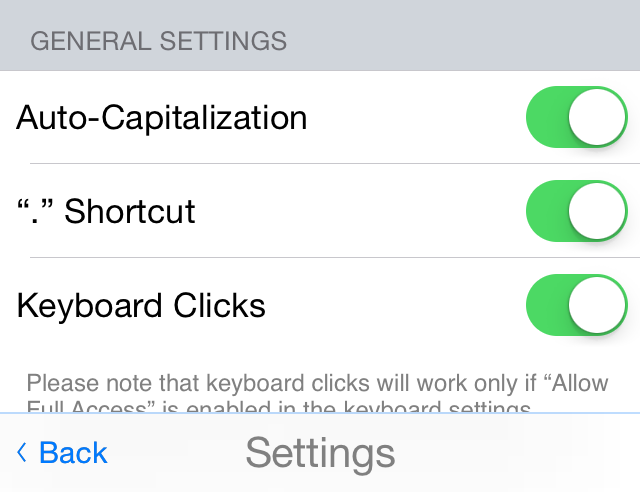

# Kouri-Vini (built on Archagon's Tasty Imitation Keyboard)

I am currently developing a keyboard and hosting app for the Kouri-Vini Community (aka Louisianan Creole, ISO-639 lou). This keyboard is build upon Archagon's Tasty-imitation-keyboard and incorporates the improvements and modifcations made by PolishedCode.

The keyboard was created to allow Kouri-Vini speakers to have a language specific keyboard. In recent years, the Kouri-Vini community developed a new orthography that fit their language better. As a result, it has become important to have a keyboard and other means of using the orthography. The language uses a large number of accented characters and I feel that Apple's mechanism for typing accented characters is (1) counter-intuitive to typing, and (2) the 'long-press' action is distruptive to steady typing. As a result, the second page of characters has the accented vowels needed for Kouri-Vini.

I am posting it on Github for the hope that others might use this code to create keyboard support for other minority languages. If you wish to contact me or learn about the current state of the Kouri-Vini Keyboard Project, check out www.keyboardsupport.wordpress.com

At the current state, the keyboard works well on iPhones. However, the landscape iPad orientation is not currently correct. If you have a solution to this, feel free to offer it on the 'issues' page. 

Additionally, if you want to contribute to this project, feel free to do so. I am only able to work on this project slowly in my spare time and would always appreciate improvements and suggestions from others.

## Recent Screenshots of Keyboard

</img> </img>
</img>

## Recent Screenshots and information regading the Hosting App
NOTE: If you want to see what the keyboard is capable of, check out the project version by PolishedCode https://github.com/polishedcode/tasty-imitation-keyboard or the original by Archagon https://github.com/archagon/tasty-imitation-keyboard . In those projects, the hosting-app is created for the purpose of allowing users to see the keyboard's capabilities. 

The Kouri-Vini Hosting app has three main purposes (1) to instruct users on how to enable the keyboard (2) allow for access to a 'chatroom' like atmostphere (yet to be completed) and (3) access to Kouri-Vini language resources.

The 'chatroom' will likely rely on Firebase, but I have yet to create it.

## Please note:
I have removed some features from PolishedCode's project to fit my needs and the needs of my audience. I have not yet removed the undesired code, but it has been left non-functioning. I also hope to revise the names of some fuctions to be conformed to the current project.

## License

This project is licensed by Archagon under the 3-clause ("New") BSD license. Credit also goes to PolishedCode and other Github members who have contributed. I also want to credit Apple for making a great keyboard to be reverse-engineered; so they too get a large bit of credit.
